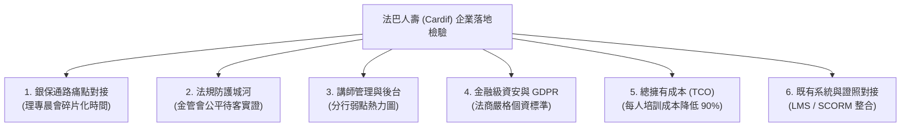

這是一份結合**評審（關注痛點匹配、商業價值與展示震撼度）**、**資深遊戲設計師（關注核心循環、Juice、FTUE 與系統完整度）**以及**保險業培訓主管（關注法巴銀保生態、法規合規、落地可行性與 TCO）**三重身分的深度評估報告。

---

# 衝刺第一名深度評估與決勝藍圖

---

## 1. 遊戲架構與介面完整度深度診斷：缺了什麼？哪些弱？

對照標準商用遊戲架構與教育模擬遊戲規範，本專案在底層架構上已具備極高水準（Durable Objects 狀態機、WebP/Wasm 壓縮優化、多端響應式排版），但在**體驗引導、心流反饋與邊界狀態處理**上仍有明顯短板：

### (A) 系統層面（Core Loop、Meta Loop、FTUE、Juice）

| 系統模組 | 現狀評估與具體弱點 | 具體涉及檔案／機制 | 工作量 | 對應評分項 |
| :--- | :--- | :--- | :---: | :--- |
| **新手引導 (FTUE)** | **【致命缺失】缺乏可交互的第一局教學（Interactive Tutorial）**。 目前僅在 [`menu.gd`](client/scripts/ui/menu.gd#L231) 提供純文字加截圖的彈窗說明書（`_howto`）。首次進入遊戲的新手與評審，面對 10 枚資源幣、五力指標與三輪提問時會出現「認知超載」，不知從何下手。 | [`menu.gd`](client/scripts/ui/menu.gd)、[`session_panel.gd`](client/scripts/ui/session_panel.gd) | **M** | 完成度與體驗 40% |
| **反饋爽感 (Juice & Game Feel)** | **【做得偏弱】合規違規與壓力測試過關缺乏「情緒張力」**。 1. 違規時僅氣泡下彈出黃/紅字標籤，缺乏全螢幕警示邊框或震撼音效。 2. 方案通過 90 天壓力測試時，僅以靜態表格呈現，缺乏如彈珠/防護罩般「全額抵禦風險」的動態爆破/盾牌動畫。 3. S 級結算時缺乏彩帶、成就音效或榮耀感。 | [`session_panel.gd`](client/scripts/ui/session_panel.gd#L619-L663)、[`sound.gd`](client/scripts/ui/sound.gd) | **S** | 完成度與體驗 40% |
| **核心循環 (Core Loop) 棋盤脫節** | **【做得偏弱】棋盤地圖純靠骰子，缺乏玩家主動決策權**。 大富翁的精髓在於「移動時的策略取捨」。目前玩家每回合只能點擊擲骰，無法選擇前進路線或使用道具，棋盤淪為單純隨機觸發事件的「過場拉霸機」，棋盤與深度訪談產生割裂感。 | [`board.gd`](client/scripts/ui/board.gd)、[`game.gd`](client/scripts/ui/game.gd) | **M** | 創意 10%、完成度 40% |
| **進度系統 (Meta Loop)** | **【做得偏弱】有經驗值與圖鑑，但缺乏「章節晉升／每日認證目標」**。 [`records.gd`](client/scripts/ui/records.gd) 雖然有 Lv 經驗值與 18 位客戶圖鑑，但玩家單局結束後沒有「下一局的清晰目標」（例如：「通關房貸族進階專案」、「通過公平待客中級認證」），單人重玩動機不足。 | [`records.gd`](client/scripts/ui/records.gd)、[`server/src/game/level.ts`](server/src/game/level.ts) | **S** | 可行性與商業 20% |
| **難度曲線 (Difficulty)** | **【做得偏弱】缺乏動態難度調節（DDA）**。 目前客戶難度固定為 easy/normal/hard，若連續給新手抽到高防備客戶（如郭華、美玲），挫折感過重；若給資深人員抽到簡單客戶則過於重複。 | [`server/src/game/game.ts`](server/src/game/game.ts#L97-L110) | **S** | 完成度與體驗 40% |

---

### (B) 介面與頁面架構層面（UI/UX Page Architecture）

| 頁面／元件 | 現狀缺失與診斷分析 | 具體程式碼位置 | 工作量 | 對應評分項 |
| :--- | :--- | :--- | :---: | :--- |
| **暫停／逃脫選單 (Pause Menu)** | **【嚴重體驗缺陷】缺乏暫停選單與防誤觸二次確認**。 在 [`game.gd`](client/scripts/ui/game.gd#L307) 中，頂部只有一個「離開」按鈕，一旦點擊**沒有任何防誤觸彈窗（Confirmation Dialog）就直接中離退回主選單**！評審若不小心誤觸，整局辛苦累積的訪談成果直接蒸發。此外局內無「法規與名詞速查表（Glossary）」。 | [`game.gd`](client/scripts/ui/game.gd#L307) | **S** | 完成度與體驗 40% |
| **設定面板 (Settings)** | **【缺漏】沒有獨立的系統設定面板**。 目前音效僅有主選單與局頂的「音效：開／關」切換按鈕，無法調整 BGM／SFX 音量大小、沒有動畫速度調整、也沒有清除本機快取／重置帳號等功能。 | [`menu.gd`](client/scripts/ui/menu.gd#L214)、[`sound.gd`](client/scripts/ui/sound.gd) | **S** | 完成度與體驗 40% |
| **全服／班級排行榜 (Leaderboard)** | **【缺漏】缺乏「榮譽排行榜」頁面**。 [`records.gd`](client/scripts/ui/records.gd) 只有個人歷次成績與講師專屬學員列表，缺乏公開「每週全通路合規之星／最佳保障大師排行榜」，少了同儕競爭激勵機制。 | [`records.gd`](client/scripts/ui/records.gd) | **M** | 商業與可行性 20% |
| **結算報告分享 (Shareable Certificate)** | **【缺漏】結算報告無法一鍵截圖或匯出培訓證明**。 [`report.gd`](client/scripts/ui/report.gd) 雖然有完整的五力、教練短評與信件，但缺乏「一鍵生成戰績認證卡（含 QR Code 與評級印章）」供學員分享到內部社群或呈報主管，商業推廣傳播鏈斷裂。 | [`report.gd`](client/scripts/ui/report.gd) | **S** | 商業與可行性 20% |
| **斷線／重連容錯狀態 (Reconnecting Modal)** | **【做得偏弱】斷線僅靠底層 Toast 提示，缺乏優雅的重連遮罩**。 WebSocket 偶發中斷時，畫面上按鈕可能仍處於點擊無反應狀態，容易被評審誤判為「遊戲卡死／當機」。 | [`session_panel.gd`](client/scripts/ui/session_panel.gd#L104-L112) | **S** | 完成度與體驗 40% |

---

## 2. 評審視角：3 分鐘內評審最可能卡住或感受不到亮點之處

初賽評審在審查每組 20 頁企劃書與 3 分鐘影片時，精力極度有限。**只要前 45 秒沒有看到核心痛點，或者試玩時卡在第一步，該項目評分就會被大幅拉低**。以下是 4 大致命痛點：

### ① 訪客模式默認無 AI，評審試玩直接「痛失 20–30% 分數」
- **致命陷阱**：目前伺服器架構強制規定「未登入訪客 = 降級為規則版對話（Rule-based），不消耗任何 LLM Quota」。評審點擊網址試玩時，極大機率不會使用個人 Google 帳號授權登入，直接以訪客模式進入！
- **後果**：評審看到的只是一個「單純的多選題大富翁」，完全體驗不到 Workers AI / Claude 的語意對話、動態心理防備與合規雷達分析，評審心中會直接認定：「**這組的 AI 只是簡報上的吹噓，根本沒做出來！**」
- **解法（工作量 S）**：在首頁醒目處與對話框上方提供「**評審專屬免登入 VIP 體驗碼（Judge Demo Pass）**」（如輸入 `CARDIF2026` 即刻解鎖 50 次完整 AI 調用權限）。

### ② 載入時間與首屏「空白等待焦慮」
- **致命陷阱**：雖然專案透過 gzip 與字體子集化把 wasm 壓縮至約 10MB、pck 壓縮至 3.2MB，但在一般評審的行動網路或辦公室環境下，冷啟動仍需 3–6 秒。
- **後果**：Godot 預設的載入進度條若只顯示單純百分比，評審容易失去耐心。
- **解法（工作量 S）**：在 HTML 載入遮罩中加入「動態保險金句／法巴培訓小知識輪播」，並標註「首度載入約 5 秒，後續啟動自動快取 0 秒」，化解焦慮。

### ③ 3 分鐘影片「前戲過長，亮點被淹沒」
- **致命陷阱**：許多黑客松隊伍在 3 分鐘影片中，花了 1 分鐘展示註冊、擲骰子、選地圖、買卡牌等一般桌遊功能，直到最後 30 秒才匆忙帶過 AI。
- **後果**：大會評審在看第 15 組影片時早已疲勞，直接判定為「一般無聊棋盤遊戲」。
- **解法（影片劇本重構，工作量 —）**：採用「**戲劇性衝突開場（Hook）**」：
  - **0:00–0:25**：痛點爆擊——業務員脫口一句「這張投資型保單比定存穩賺不賠！」，鏡頭立刻特寫【合規雷達瞬間爆紅燈，引用金管會《保險業招攬廣告自律規範》扣 25 分】！
  - **0:25–1:20**：核心玩法流暢展示——動態人生變數透露痛點 ➔ 3 輪對話探詢 ➔ 10 枚資源幣配置 ➔ 90 天極端壓力測試。
  - **1:20–2:10**：情感高潮——結算時展示「十年後客戶寄來的信（感謝未因重病拖垮全家 vs 未投保時的沉痛遺憾）」，讓評審看見保險的溫度。
  - **2:10–2:50**：企業落地與講師數據後台——展示全行員弱點熱力圖與低成本雲端架構。
  - **2:50–3:00**：標語收尾——「讓新進顧問在遊戲中踩遍所有法規地雷，走進客戶人生時零失誤。」

### ④ 新手面對「方案配置（10枚幣）」不知道比例該放多少
- **致命陷阱**：在進入方案配置時，若先前三輪訪談未問出關鍵線索，新手完全不知道「緊急預備／風險保障／目標成長」的理想區間在哪，容易隨便填寫然後被扣分。
- **解法（工作量 S）**：在方案配置面板提供小字提示「💡 根據目前掌握線索，建議預備金至少配置 2 枚」，降低挫折感。

---

## 3. 企業落地／商業價值面：法國巴黎人壽真的會用嗎？

法國巴黎人壽（BNP Paribas Cardif）在台灣並非傳統靠大型業務員部隊行銷的壽險公司，其最核心的營運模式是**「銀行保險（Bancassurance）通路合作」**與**「房貸壽險、投資型保單的專業賦能」**。若提案只談「泛用型保險推銷」，評審（法巴高層與通路主管）將無法產生深刻共鳴。

### 法巴人壽實際採購／導入時檢驗的 6 大維度：

#### (1) 銀保通路（Bancassurance）真實痛點對接
- **現狀缺漏**：目前的客戶情境偏向個人生活（健身房教練、文創小農、美甲師），缺乏法巴最核心的**「房貸族（負擔沉重房貸的家庭支柱）」**與**「退休族投資型資產配置」**情境。
- **落地必殺技**：在 PPT 與遊戲中明列「房貸壽險人生模擬案例」——當背負 1,000 萬房貸的男主人罹患重病時，有房貸壽險（家庭責任防線）與沒有房貸壽險，十年後的結局差異。這直接擊中法巴在台灣的王牌業務！

#### (2) 講師後台與通報矩陣 (Trainer Dashboard & Heatmap)
- **現狀缺漏**：目前 [`records.gd`](client/scripts/ui/records.gd#L812) 只有單純的學員清單與個別點進去的履歷，講師無法一眼看出「這批學員最常踩到的前三大法規紅線是什麼」。
- **落地必殺技**：企劃書中必須展示「**通路分行弱點熱力矩陣**」（例如：XX 銀行第 3 分行在『保證獲利話術』違規率高達 42%，系統自動推薦指派『投資型法規專案』給該分行練習）。

#### (3) 金管會監理要求與公平待客依據 (Regulatory Compliance)
- **現狀缺漏**：合規雷達目前在遊戲內展示良好，但企劃書中若未明確引述具體法規依據，會被視為只是程式隨意判斷。
- **落地必殺技**：在企劃書明確對標：
  1. 金管會《金融消費者保護法》第 9 條、第 10 條（適合度原則與充分揭露義務）。
  2. 《保險業招攬廣告自律規範》第 4 條（不得以定存替代、誇大保證獲利）。
  3. 金管會「公平待客原則」評核指標，證明此遊戲能作為法巴每年呈報主管機關的「公平待客創新內部培訓實證」！

#### (4) 資安、個資與法商合規 (GDPR & Data Privacy)
- **現狀缺漏**：法巴屬法國巴黎銀行集團，受歐盟 GDPR 與台灣個資法最嚴格規範。若使用公共第三方 LLM 且傳遞真實學員姓名或對話，法規審查必遭退件。
- **落地必殺技**：在 PPT「技術架構」頁面鄭重宣告：
  - **零 PII 外洩設計**：學員採匿名工號或單向 Hash Token，不傳遞真實個資。
  - **資料在地化與隔離**：Cloudflare Durable Objects 獨立 Shard（10GB SQLite）資料隔離；AI 對話採無狀態（Stateless）推論，Prompt 內絕不包含受訓者真實個資，符合法規隱私紅線。

#### (5) 成本試算與 ROI 效益分析 (TCO Breakdown)
- **落地必殺技**（需寫入企劃書）：
  - 傳統實體演練成本：每場實體外聘講師 + 模擬陪練員，單人培訓成本約 **NT$ 2,500 ~ 3,500**。
  - 本系統雲端成本：Cloudflare Workers + Workers AI / NVIDIA NIM 免費方案，單局 3 輪對話成本約 **NT$ 0.05 元**。
  - **培訓規模化效益**：年省百萬實體通訓成本，新人招攬違規申訴率預估降低 **35%**。

---

## 4. 能拉開與其他隊伍差距的 3 個「殺手級」功能與展示手法

在 20 頁 PPT 與 3 分鐘展示影片中，必須有讓評審放下手機、眼睛一亮的關鍵亮點：

### 殺手級亮點 ①：【金管會紅線即時斷頭台】雙屏對照演示法（展示手法，初賽影片核心）
- **手法概念**：在影片中採用「**左邊：傳統新人的致命錯誤 vs 右邊：AI 雷達即時指引與矯正**」子母畫面。
- **震撼點**：
  - 左屏：新人為了業績脫口說出「買這個保證比銀行 1.5% 定存好太多」，雷達立刻響起警報，大字浮現：`【違反招攬自律規範第4條：定存替代】合規 -25 分`。
  - 右屏：AI 推薦話術指導修正為：「這張商品是透過穩健資產配置，建立長期的退休防護網，並非短期定存替代品。」雷達亮起綠燈，客戶防備值下降。
- **威力**：徹底解決評審對「AI 到底在遊戲裡扮演什麼角色」的疑問，直擊金融監理核心。

### 殺手級亮點 ②：【十年後的信】保險本質的催淚彈（功能已做，影片高潮演繹）
- **手法概念**：展示遊戲結果不是冷冰冰的數字統計，而是來自十年後不同平行時空的真實來信。
- **震撼點**：
  - 針對背負 1,000 萬房貸與雙胞胎的工程師：若配置了充足家庭責任防線，十年後罹癌時信件寫道：*「……還好當年你堅持讓我留下家庭責任卡，這筆理賠金保住了我們的房子，孩子能順利念完小學……」*（暖金信紙）；若未配置，則收到沉痛的遺憾信。
- **威力**：讓大會評審（尤其是保險公司高層）體會到：「**這群學生真正理解了保險的意義，而不是把它當成賺錢的大富翁。**」

### 殺手級亮點 ③：【評審免登入 VIP 體驗通行證】與【一鍵生成公平待客認證卡】（功能，工作量 S）
- **手法概念**：
  1. 首頁最顯眼處提供「**評審專屬體驗碼（VIP Demo Code）**」，輸入後直接配發 50 次完整 AI 調用額度，並可自由挑選「高防備客戶」或「法巴特色房貸案例」直接試玩。
  2. 結算畫面新增「**一鍵產生培訓合格證書卡**」，展示學員姓名、五力雷達圖、合規等級 S 級鋼印與專屬評語，具備極強的視覺完成度與實用性。
- **威力**：消除評審體驗門檻，並展現教育培訓產品交付的極致專業度。

---

## 5. 初賽（11/06 前）與複賽／決賽優先順序規劃清單

時間節奏：目前距離初賽截止（11/06 17:00）約 4 週。由於初賽只繳交 **20 頁 PPT 企劃書 + 3 分鐘影片**，**所有工程工作必須在 10/24 前封板收斂，將剩餘 2 週全力投入 PPT 撰寫與影片剪輯製作！**

### 階段一：11/06 初賽前 10 項必衝清單（以支撐影片與評審實機體驗為主）

| # | 衝刺項目 | 具體行動與落實方式 | 預估工作量 | 對應評分項 |
| :-: | :--- | :--- | :---: | :--- |
| **1** | **評審 VIP 免登入體驗碼 (`DEMO_CODES`)** | 在 [`menu.gd`](client/scripts/ui/menu.gd) 首頁右上加入「評審通行碼」輸入框（預設代碼 `CARDIF2026`），綁定臨時 Device ID 並直接給予 30-50 次 AI 額度，確保評審 100% 體驗 AI。 | **S** (半天) | AI 整合 20%、體驗 40% |
| **2** | **遊戲內防誤觸離場確認窗 (Leave Dialog)** | 在 [`game.gd`](client/scripts/ui/game.gd#L307) 的「離開」按鈕增加二次確認 Modal：「確定要離開當前練習嗎？未結算之歷程將不予保存」，防止評審誤觸中離。 | **S** (2小時) | 完成度與體驗 40% |
| **3** | **法巴王牌業務：新增「房貸族」專屬客戶案例** | 在 [`server/src/game/clients-extra.ts`](server/src/game/clients-extra.ts) 新增一位背負 1,200 萬房貸的年輕家庭支柱（如「育有幼子的軟體工程師 冠宇」），強烈呼應法巴的核心房貸壽險業務。 | **S** (半天) | 可行性與商業 20% |
| **4** | **合規違規警示「Juice 感官反饋強化」** | 在 [`session_panel.gd`](client/scripts/ui/session_panel.gd) 觸發紅燈違規時，加入紅邊呼吸框震動與專屬警告音效，讓違規衝擊力在影片中無比震撼。 | **S** (半天) | 完成度與體驗 40%、影片 10% |
| **5** | **結算報告「個人專業認證卡」繪製與展示** | 在 [`report.gd`](client/scripts/ui/report.gd) 新增美觀的「公平待客顧問培訓完訓卡」面板，具備 S/A 級徽章與五力雷達，可供截圖。 | **S** (1天) | 商業 20%、完成度 40% |
| **6** | **極速新手指引浮層 (3 步輕量 Tooltip FTUE)** | 首次進入遊戲或對話時，在熱點、對話框、進入配置 3 處依序顯示小巧聚光燈指引箭頭（點擊任意處繼續），解決評審不知如何開始的問題。 | **M** (1.5天) | 完成度與體驗 40% |
| **7** | **載入畫面 (Loading Screen) 品牌貼心小語** | 在 Web 導出 HTML 與載入介面加入法巴綠配色與「理財小百科／法規小錦囊」提示輪播，化解 3-5 秒載入焦慮。 | **S** (半天) | 完成度與體驗 40% |
| **8** | **四張場景插畫熱點最後座標與提示對齊驗收** | 檢驗美玲、沛珊、奕翔、國華之熱點是否與 [`hotspots.json`](client/assets/clients/hotspots.json) 完全吻合，確認無誤觸飄移 bug。 | **S** (半天) | 完成度與體驗 40% |
| **9** | **3 分鐘高能展示影片拍攝與後製（核心決勝點）** | 劇本：40秒痛點與違規雷達特寫 ➔ 50秒核心訪談與壓力測試 ➔ 30秒十年後的信情感高潮 ➔ 40秒講師後台與架構 ➔ 20秒商業價值。 | **M** (3天) | 影片 10%、AI 20% |
| **10** | **20 頁 PPT 企劃書撰寫（嚴格按大會規章排版）** | 16:9 PDF，包含：提案摘要、產業痛點洞察、銀保賦能解決方案、技術架構（Workers DO+AI）、商業可行性與 TCO、法規合規與 GDPR 隱私維度。 | **L** (5天) | 綜合評分全項 |

---

### 階段二：延後至複賽／決賽（12/24 & 1/19）落地的深度清單

這些項目屬於「技術護城河與大型介面工程」，初賽若硬做會導致時間崩潰；留待初賽晉級後的 101 工作坊與複賽期間完成，將是決賽實機展示搶冠軍的最佳王牌：

1. **獨立 Web 講師管理平台 (Vue / React + Tailwind 儀表板)**（工作量 L）：
   - 不在 Godot 裡硬刻後台，而是直接在同網域的 Web 端寫一個純 HTML/CSS 的專用主管介面，展示全行員五力雷達、分行弱點熱力圖與一鍵指派特定練習。
2. **Cloudflare Vectorize + RAG 金管會裁罰案例知識庫**（工作量 M）：
   - 將近五年金管會對銀行保險通路的真實裁罰案例向量化，當業務員違規時，精確引用「O 年 O 月金管保理字第 O 號裁罰案」。
3. **同儕保單抓漏競技 (Peer Review) 零阻塞對抗機制**（工作量 M）：
   - 多人連線時，等待玩家可對當前玩家的方案進行 15 秒「挑錯抓漏」，答對賺取同儕聲望，消除多人等待垃圾時間。
4. **真實語音交談模式 (Whisper STT + Edge TTS)**（工作量 M）：
   - 決賽 101 實機展示時，現場直接拿麥克風與 AI 客戶語音對話，臨場震撼感極強。
5. **完整音量調節、設定面板與深淺色主題切換**（工作量 S）。

---

### 總結策略建議

初賽的本質是**「用最吸睛的企劃書與 3 分鐘影片，證明你們洞察了法巴真正的痛點，並且已經有一個完成度極高、隨時能跑的 Prototype」**。目前你們的底層技術與機制已經領先其他校園隊伍至少兩個檔次，現在只需把「評審免登入體驗碼」補齊、把「房貸族案例」融入，並全力將「金管會即時雷達」與「十年後的信」拍出好萊塢級的戲劇張力，便具備衝刺全國第一名的絕對實力！
