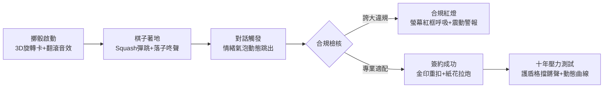

# Round 4 專家審視報告：玩法機制、介面風格、美術與動態體驗

> **審視身分**：資深遊戲設計師 × 美術總監 × 評審視角  
> **核心目標**：備戰 Cardif InsurHack 1-1（11/06 繳交 20 頁 PPT + 3 分鐘影片），以「評審第一眼印象、影片爆點、法巴人壽品牌共鳴、完備合規說服力」為最高準則。

---

## 1. 玩法機制：強化「大富翁」策略與「財務人生 / 售後理賠」連動

### 現況痛點
如 [frame-14.jpg](file:///Users/kenchou2006/Documents/INSURE-QUEST/insure-quest-godot/docs/design/round4-shots/frame-14.jpg) 所示，外圍 24 格棋盤目前只是單純的「跳格子抽籤器」，中間直接被巨大對話框蓋住。一旦面談結束簽約，客戶只化為右側統計數字（`業績 +20, 客戶 +1`），與棋盤後續進程完全脫節，缺乏大富翁應有的「經營感」與保險業最核心的「售後服務與理賠陪跑」。

---

### 機制提案與評估

#### 機制一：售後服務與理賠連動（人生事件打擊客戶簿）
- **機制說明**：簽約後的客戶常駐右側「我的客戶簿」。當任何玩家踩到「人生事件格」（或每季結算遭遇宏觀事件如疫情、通膨、股市修正）時，事件會隨機抽中一名已簽約客戶。
  - **有適配防護**：若該客戶當年配置的保障卡能吸收風險，觸發「理賠服務成功」，彈出感謝通知，玩家獲得「聲望 +10、忠誠轉介機會」。
  - **有防護缺口**：若當初為了衝業績配置不當，觸發「保障缺口受創」，客戶資產縮水，玩家扣聲望並增加客訴風險。
- **優點**：完美將「大富翁棋盤」與「十年防護」無縫閉環，向評審傳達「保險不是簽完約就結束，售後理賠才是檢驗顧問專業的開始」。節奏輕快（彈窗 2 秒自動收合），完全不拖慢遊戲。
- **工作量**：**S**
- **影響評分項**：完成度與體驗（40%）、可行性與商業（20%）、題目契合度
- **具體檔案**：
  - [server/src/game/engine.ts](file:///Users/kenchou2006/Documents/INSURE-QUEST/insure-quest-godot/server/src/game/engine.ts)
  - [server/src/game/events.ts](file:///Users/kenchou2006/Documents/INSURE-QUEST/insure-quest-godot/server/src/game/events.ts)
  - [client/scripts/ui/board.gd](file:///Users/kenchou2006/Documents/INSURE-QUEST/insure-quest-godot/client/scripts/ui/board.gd)

#### 機制二：客戶地標插旗與轉介網絡（Territory & Referral Synergy）
- **機制說明**：在特定「客戶格」簽約成功後，該格子永久蓋上該玩家的「服務顧問徽章」與客戶迷你頭像。
  - **自己再次經過**：觸發「保單健檢／客戶轉介」，直接獲得 1 次免擲骰前進或額外聲望。
  - **對手踩到該格**：不能奪走客戶，但觸發「同業拜訪／市場口碑」，對手需向該地標繳納諮詢聲望或觸發經驗交流。
- **優點**：盤面視覺隨遊玩進度產生變化，原本空蕩的外圍格子會逐步點亮成玩家的「客戶服務版圖」，大富翁的領地佔有感油然而生。
- **工作量**：**S**
- **影響評分項**：完成度與體驗（40%）、創意（10%）
- **具體檔案**：
  - [server/src/game/game.ts](file:///Users/kenchou2006/Documents/INSURE-QUEST/insure-quest-godot/server/src/game/game.ts)
  - [client/scripts/ui/board.gd](file:///Users/kenchou2006/Documents/INSURE-QUEST/insure-quest-godot/client/scripts/ui/board.gd)

#### 機制三：整局以「客戶十年健全度＋公平待客」為終局勝負標準
- **機制說明**：徹底顛覆傳統大富翁「看誰錢多/誰破產」的掠奪邏輯。遊戲結算分數公式由 `簽約保費總額` 改為：
  $$\text{最終得分} = \text{基礎業績} + \sum (\text{客戶十年資產存活率} \times \text{信任度}) - (\text{合規申訴件數} \times 100)$$
  若局內曾吃過重大紅燈（如 [frame-86.jpg](file:///Users/kenchou2006/Documents/INSURE-QUEST/insure-quest-godot/docs/design/round4-shots/frame-86.jpg) 遭金融評議中心申訴），評級上限直接鎖死在 C，無緣優秀顧問獎。
- **優點**：直擊法巴人壽評審痛點——銀行保險通路最怕理專不當招攬引來金管會開罰。在 PPT 與影片中作為「價值觀亮點」震撼呈現。
- **工作量**：**S**
- **影響評分項**：可行性與商業（20%）、影片（10%）
- **具體檔案**：
  - [server/src/game/engine.ts](file:///Users/kenchou2006/Documents/INSURE-QUEST/insure-quest-godot/server/src/game/engine.ts)
  - [client/scripts/ui/settlement.gd](file:///Users/kenchou2006/Documents/INSURE-QUEST/insure-quest-godot/client/scripts/ui/settlement.gd)

#### 機制四：路線分支選擇（Career Branching / 內外圈）——【評審警告：強烈建議排除】
- **機制說明**：走到特定路口可選擇走「外圈：深耕社區大眾市場（客單低、穩定）」或「內圈：企業主與高淨值客群（客單高、合規稽核密集）」。
- **破壞平衡與節奏分析**：
  - **嚴重拖慢節奏**：每圈需要玩家停下思考路線，大幅增加決策時間與 UI 點擊次數。
  - **工程負擔過大**：Godot 的 [board.gd](file:///Users/kenchou2006/Documents/INSURE-QUEST/insure-quest-godot/client/scripts/ui/board.gd) 目前基於 24 格單環幾何公式 `_point_on_ring()` 計算棋子座標與插值。改為多分支尋路圖論需重寫整個盤面渲染與移動補間，成本為 **L**，且 3 分鐘影片根本展現不出分歧深度的精髓。
- **結論**：初賽完全延後，不要在 11/06 前碰這項。

#### 機制五：顧問賦能策略手牌（Toolkit Action Cards）——【評審警告：需大幅簡化】
- **機制說明**：在合規格或研討會抽手牌（例如：「家庭收支快篩卡」、「合規免死金牌」），玩家可在擲骰前或面談時打出。
- **破壞平衡與節奏分析**：多數實體卡牌遊戲數位化失敗的主因就是「常態性詢問視窗（Do you want to play a card?）」。若每回合多一次手牌管理，一局時間會從 8 分鐘拖長到 15 分鐘。
- **折衷方案**：初賽若要做，改為**踩格即時自動獲得被動增益（Passive Buff）**，如「獲得一次合規黃燈豁免護盾」，不需手牌介面。

---

## 2. 介面風格：從「後台儀表板」轉型為「法式精緻輕桌遊」

### 現況診斷
從 [frame-8.jpg](file:///Users/kenchou2006/Documents/INSURE-QUEST/insure-quest-godot/docs/design/round4-shots/frame-8.jpg) 與 [frame-56.jpg](file:///Users/kenchou2006/Documents/INSURE-QUEST/insure-quest-godot/docs/design/round4-shots/frame-56.jpg) 可以明顯看出：
1. **配色像伺服器後台**：底色 `#0b1f2a`、面板 `#13303f` 是典型的網管／監控系統深青黑，冷冽無生氣。
2. **缺乏實體桌遊質感**：按鈕只是純色圓角框，保障卡像 HTML 表單的 Checkbox，資源幣像簡單的計數器，完全沒有「把玩桌遊組件」的樂趣。
3. **資訊階層平鋪直敘**：字體粗細與顏色對比度不足，視線找不到焦點。

---

### 兩大視覺方向比較

| 維度 | 方向 A：法式現代輕桌遊風（Modern French Board Game） | 方向 B：新未來數位銀行風（Neobank Fintech Glassmorphism） |
| :--- | :--- | :--- |
| **視覺靈感** | 《Wingspan 展翅翱翔》、《Monopoly GO!》、《雙重人生》 | Revolut、Apple Card、加密貨幣交易終端 |
| **主調氛圍** | 溫暖、專業、翡翠與香檳金相間，富有人文溫度與紙牌觸感 | 酷炫、極簡高冷、高透毛玻璃、霓虹發光描邊 |
| **情感傳達** | 「陪伴客戶走過人生起伏的可靠顧問」 | 「高科技、高效率的量化理財工具」 |
| **評審共鳴** | **極高**。法巴人壽講究永續、普惠金融與人性化服務 | 中等。偏向科技宅，容易回到原本冷冰冰的後台感 |
| **實作成本** | **M**（以 Godot `StyleBoxFlat` 陰影與邊框微調即可達成） | **L**（Godot 4.7 的 Shader 毛玻璃模糊在 WebAssembly 效能消耗大） |

### 推薦方向：【方向 A：法式現代輕桌遊風】

#### 呼應法巴品牌（綠色系）而不侵權的設計語言
法國巴黎人壽的品牌精髓在於 **“The bank for a changing world”** 與其標誌性的祖母綠階調。我們不使用其四星飛鳥商標，而是擷取其**「優雅深綠 + 暖金微光 + 象牙白文字」**的法式高端金融色感：

```
主背景基底 (Base BG):      #0d231e (沉穩溫潤的深森林綠，取代原先死沉的深藍 #0b1f2a)
主要容器面板 (Panel Base): #14352d (深祖母綠啞光，帶 1.5px 翡翠微光描邊)
次級容器面板 (Panel Muted):#1a4239 (微調對比層次)
品牌核心綠 (Cardif Jade):  #00875a (法巴經典祖母綠，用於主操作按鈕與成功進度)
輔助亮綠光 (Emerald Glow): #2ed59e (用於選取光暈、正面高亮指標)
溫潤香檳金 (Champagne Gold):#e5a93c (用於聲望等級、金幣、三星指標、關鍵評級)
警戒警示紅 (Audit Crimson):#e63946 (合規紅燈、申訴警訊)
主字體色 (Primary Text):   #f4fbf7 (微透暖綠的象牙白，告別死白)
副字體色 (Muted Text):     #9ebdb3 (柔和灰綠，層次分明)
```

#### 元件設計規範（Design Tokens for [client/scripts/ui/ui.gd](file:///Users/kenchou2006/Documents/INSURE-QUEST/insure-quest-godot/client/scripts/ui/ui.gd)）
1. **圓角與陰影規則**：
   - 面板容器：`radius: 16px`，雙層陰影 `shadow_color: Color(0, 0, 0, 0.35), shadow_size: 6, shadow_offset: (0, 3)`。
   - 保障卡牌：`radius: 12px`，邊框寬度 `2px`，未選中為 `#234d42`，選中時變為 `#2ed59e` 帶 `4px` 金綠光暈。
2. **按鈕狀態（桌遊壓克力質感）**：
   - `Normal`：底色 `#00875a`，頂部自帶 1px 亮線（高光仿琺瑯質感）。
   - `Hover`：底色 `#009e69`，外擴微光。
   - `Pressed`：底色 `#006f4a`，內容向下微移 2px，陰影縮減至 1px（實體按壓觸感）。
3. **字級層級（Type Scale）**：
   - 畫面大標（Screen Title）：`28-32px Bold`（象牙白 `#f4fbf7`）
   - 卡片標題與關鍵數值：`18-20px SemiBold`（香檳金 `#e5a93c`）
   - 內文與對話泡泡：`14-15px Regular`（`#f4fbf7`）
   - 附註與法規指引：`11-12px Regular`（`#9ebdb3`）
4. **工作量**：**M**
5. **影響評分項**：完成度與體驗（40%）、影片（10%）
6. **具體檔案**：[client/scripts/ui/ui.gd](file:///Users/kenchou2006/Documents/INSURE-QUEST/insure-quest-godot/client/scripts/ui/ui.gd)

---

## 3. 美術資產檢視與 AI 重做 Prompt 清單

### 現有美術診斷表

| 資產類別 | 現況問題 | 處理決策 | 理由與調整方向 |
| :--- | :--- | :--- | :--- |
| **主選單插畫** (`title.jpg`) | 雨夜房間 + 筆電下跌 K 線，**過度憂鬱喪氣**（見 frame-8） | **必須重做** | 競賽主題是守護與賦能，評審第一眼不能看到破產沮喪畫面。應改為晨光灑入的溫暖客廳或都會咖啡廳，傳達希望與陪伴。 |
| **棋盤格子** | 通用文字 + 簡單圖示，空洞（見 frame-14） | **保留程式碼，重構繪製** | 不需載入 24 張大圖，改用 Godot 向量繪製帶質感的卡牌式插槽底座與精緻圖騰。 |
| **棋子** | 單純圓球 + 姓氏單字，像工程標記 | **升級外觀** | 內部已實作優異的 Squash/Stretch 跳躍，只需在頂部套上立體金屬鑲邊與職業剪影符號。 |
| **客戶頭像** | 面談對話框內只有 **24x24 房間縮圖**（見 frame-22） | **核心重做** | **重大扣分項**。訪談缺乏主角臉孔，無法產生情感共鳴。必須生成 10 位客戶清晰生動的正面胸像立繪。 |
| **場景探索圖** | 構圖優美、新海誠動漫風（見 frame-14 底下） | **高度保留** | 品質極高，物件分佈合理。只需調整 UI 佈局，避免在探索時被視窗邊界硬生生裁切。 |

---

### 統一美術風格描述（Style Guide for Flux）
```text
Art Style Baseline: Modern Makoto Shinkai and Ghibli inspired anime digital illustration, warm golden hour natural lighting, inviting cinematic composition, soft film grain, highly polished commercial key visual, cheerful, hopeful, dignified and heartwarming tone. No distorted faces, no extra limbs, no readable text, no watermarks.
```

---

### 可直接執行的 Workers AI Flux Prompt 清單

#### 1. 主選單首頁主視覺（取代憂鬱雨夜）
- **儲存路徑**：`client/assets/title.jpg`
- **Prompt**：
```text
Makoto Shinkai anime style key visual, heartwarming modern Taiwanese city apartment living room on a bright sunny morning. Warm natural sunlight streaming through sheer white curtains of a large floor-to-ceiling balcony window overlooking a clean Taipei skyline. On a light natural oak coffee table in the foreground: a steaming porcelain ceramic cup of latte with gentle heart-shaped foam, a tablet displaying a sleek financial life-planning roadmap diagram with rising green growth curves and shield safety icons, a blooming green succulent potted plant, and a warm framed family photo. Cozy modern furniture, soft bokeh city background, optimistic, professional, peaceful, premium financial life planning atmosphere, masterpiece, ultra-detailed anime background art, empty room, no human figures, clean digital painting.
```

#### 2. 客戶胸像立繪（生成至 `client/assets/avatars/`）

- **劉家豪（軟體工程師・新手爸爸，31歲）**：
```text
Makoto Shinkai anime style character portrait, bust up shot of a gentle 31-year-old Taiwanese male software engineer and new father. Warm friendly smile, short neat black hair, modern titanium round-frame glasses, wearing a comfortable light grey cotton hoodie over a white t-shirt. A soft baby carrier strap visible over his shoulder. Warm domestic indoor lighting, clean soft blurred apartment background, high resolution anime digital art, expressive warm brown eyes, approachable and responsible look, transparent or clean bokeh background.
```

- **張美玲（單親行政・雙職母親，38歲）**：
```text
Makoto Shinkai anime style character portrait, bust up shot of a resilient 38-year-old Taiwanese single mother and office administrator. Gentle maternal smile with slight determined expression, soft shoulder-length dark brown hair tied in a practical low ponytail, wearing a soft pastel blue collared blouse and delicate pearl earrings. Warm afternoon golden hour sunlight, clean blurred modern office background, expressive kind eyes, professional yet warm, high resolution anime digital portrait.
```

- **鄭文傑（國中教師・即將退休，58歲）**：
```text
Makoto Shinkai anime style character portrait, bust up shot of a respectable 58-year-old Taiwanese male junior high school teacher approaching retirement. Kind grandfatherly crinkle around his eyes, dignified warm smile, slightly greying temples with neat combed hair, wearing a classic beige knit cardigan over a light plaid collared shirt. Warm faculty room background bokeh, intellectual, trustworthy, serene and wise expression, high resolution anime digital art.
```

- **蔡依婷（行銷專員・職場新鮮人，24歲）**：
```text
Makoto Shinkai anime style character portrait, bust up shot of an energetic 24-year-old Taiwanese female marketing executive and college graduate. Bright vibrant smile, trendy shoulder-length bob haircut with subtle warm brown highlights, wearing a chic beige blazer over a pastel yellow inner shirt, cute small earphones hanging loosely around neck. Bright sunny cafe background bokeh, ambitious, youthful, friendly and enthusiastic expression, crisp anime digital illustration.
```

- **工作量**：**S-M**
- **影響評分項**：AI 應用（20%）、完成度與體驗（40%）、影片展示
- **具體檔案**：
  - [server/tools/generate-all-scenes.mjs](file:///Users/kenchou2006/Documents/INSURE-QUEST/insure-quest-godot/server/tools/generate-all-scenes.mjs)
  - [client/assets/title.jpg](file:///Users/kenchou2006/Documents/INSURE-QUEST/insure-quest-godot/client/assets/title.jpg)

---

## 4. 動態與回饋（Juice / Game Feel）規劃

保險培訓通常容易流於死板枯燥，**強大的遊戲回饋動態（Juice）是 3 分鐘影片能否抓住評審目光的決勝點**。以下是 6 個關鍵節點的聲光規劃：



### 1. 擲骰動態（Dice Roll）
- **動畫**：點擊後中央浮現立體質感雙色骰子（綠白配），旋轉翻滾 0.5 秒並帶動態模糊，定格時帶有彈跳下沉反作用力。
- **音效**：清脆的木質骰盅搖晃聲 `dice_roll.ogg`，停格時伴隨清脆叮響 `dice_settle.ogg`。

### 2. 棋子移動與落子（Pawn Hop & Landing）
- **動畫**：保留目前現有的 Squash & Stretch 物理曲線，但在著地瞬間追加直徑 20px 的「向外微擴散光環（Ring Ripple）」。
- **音效**：每步維持短促步伐聲，最後停在目標格時觸發沉穩的木質棋子落盤聲 `pawn_land.ogg`。

### 3. 合規違規／紅燈三件套（Red Light Penalty）——【影片核心 Hook】
- **動畫**：
  1. 螢幕四邊全域泛起紅色呼吸暗角（Vignette Pulse，持續 1.2 秒）。
  2. 視窗劇烈震動 0.3 秒（Screen Shake，幅度 6px）。
  3. 中央對話框上方重重蓋下傾斜的紅色印章動畫：「🚨 合規違規：誇大承諾」，伴隨合規分數 -25 鮮紅浮字向上飄散。
- **音效**：沉重的低頻蜂鳴警報聲 `buzzer_violation.ogg`，接續印章重扣音。
- **評審視角價值**：**影片第 10 秒最佳開場素材**——「理專說了一句『保證獲利比定存好』，系統立刻亮紅燈警告！」直切金管會稽核痛點。

### 4. 簽約成功（Deal Closed）
- **動畫**：簽署面板中央浮現金光，一張燙金保單自上而下彈出，伴隨彩色紙花（Confetti Particles）向兩側噴散，業績計數器以滾輪數字跳動（Rolling Counter: 0 → +20）。
- **音效**：鋼筆簽名刮紙聲 + 清脆的金幣入袋歡呼聲 `contract_success.ogg`。

### 5. 十年壓力測試護盾（Stress Test Shield）
- **動畫**：如 [frame-62.jpg](file:///Users/kenchou2006/Documents/INSURE-QUEST/insure-quest-godot/docs/design/round4-shots/frame-62.jpg) 的三大危機（過勞住院、家庭傷病、股市重挫）。不要一次性全部刷出，而是按順序間隔 0.6 秒依序觸發：
  - 危機事件由黑轉紅衝向中央，防護條發出綠光「防禦網展開」，彈出「穩健承接」勳章。
- **音效**：沉重的金屬格擋碰撞聲（Shield Block SFX），營造「危機被安全抵擋」的安心感。

### 6. 十年財務曲線動態展現（10-Year Curve Draw）
- **動畫**：如 [frame-86.jpg](file:///Users/kenchou2006/Documents/INSURE-QUEST/insure-quest-godot/docs/design/round4-shots/frame-86.jpg)，折線圖絕不能靜態顯示！折線應在 1.5 秒內由第 0 年向第 10 年動態「劃線繪製（Line Draw Tween）」：
  - 紅線在第 2 年因過勞住院急速下墜斷崖；綠線在防禦網接住後平緩向上，兩線拉開差距時高亮閃爍「資產保全差額：NT$ 33 萬」。
- **音效**：繪線時平穩上升的音調頻率，結尾定格出現清脆銅鐘聲。
- **工作量**：**S-M**
- **影響評分項**：影片（10%）、完成度與體驗（40%）
- **具體檔案**：
  - [client/scripts/ui/interview.gd](file:///Users/kenchou2006/Documents/INSURE-QUEST/insure-quest-godot/client/scripts/ui/interview.gd)
  - [client/scripts/sound.gd](file:///Users/kenchou2006/Documents/INSURE-QUEST/insure-quest-godot/client/scripts/sound.gd)
  - [client/scripts/ui/settlement.gd](file:///Users/kenchou2006/Documents/INSURE-QUEST/insure-quest-godot/client/scripts/ui/settlement.gd)

---

## 5. 11/06 前 ROI 排序清單（≤ 8 項）與延後清單

### 決策準則
初賽繳交物僅有 **20 頁 PPT + 3 分鐘影片**。評審極高機率不會親自編譯跑遊戲，所有工程投資必須嚴格依據**「影片拍得出震撼畫面、PPT 講得出商業深度」**進行排序。

### 11/06 前必做清單（按 ROI 排序，共 8 項）

| 排序 | 項目名稱 | 內容摘要 | 工量 | 影響評分項 | 具體檔案 |
| :---: | :--- | :--- | :---: | :--- | :--- |
| **1** | **合規違規紅燈 Juice 三件套** | 紅框呼吸、螢幕震動、警示蜂鳴音、紅色印章蓋章動畫。作為影片開場與公平待客最吸睛展示。 | **S** | 影片 (10%)、體驗 (40%) | [interview.gd](file:///Users/kenchou2006/Documents/INSURE-QUEST/insure-quest-godot/client/scripts/ui/interview.gd)<br>[sound.gd](file:///Users/kenchou2006/Documents/INSURE-QUEST/insure-quest-godot/client/scripts/sound.gd) |
| **2** | **主選單主視覺更新為希望晨光** | 用 Workers AI Flux 重跑溫暖晨光客廳插畫，替換抑鬱雨夜圖，洗刷「韭菜破產」負面印象。 | **S** | 體驗 (40%)、影片 (10%) | `title.jpg`<br>[menu.gd](file:///Users/kenchou2006/Documents/INSURE-QUEST/insure-quest-godot/client/scripts/ui/menu.gd) |
| **3** | **客戶正面大頭肖像立繪生成** | 為 10 位客戶生成生動正面胸像立繪，在面談對話泡泡旁顯示 72x72 頭像與情緒狀態標籤。 | **M** | AI (20%)、體驗 (40%)、影片 (10%) | `generate-all-scenes.mjs`<br>[interview.gd](file:///Users/kenchou2006/Documents/INSURE-QUEST/insure-quest-godot/client/scripts/ui/interview.gd) |
| **4** | **十年財務曲線動態劃線與護盾動效** | 折線圖加入 1.5 秒動態繪製 Tween，壓力測試三連擊加入護盾格擋光效與音效，影片精彩高潮。 | **S** | 影片 (10%)、體驗 (40%)、創意 (10%) | [settlement.gd](file:///Users/kenchou2006/Documents/INSURE-QUEST/insure-quest-godot/client/scripts/ui/settlement.gd)<br>[sound.gd](file:///Users/kenchou2006/Documents/INSURE-QUEST/insure-quest-godot/client/scripts/sound.gd) |
| **5** | **介面換膚：法式輕桌遊色票與按鈕質感** | 將 `ui.gd` 全局色票轉為翡翠祖母綠 + 象牙白 + 香檳金，調整邊框與按鈕壓克力微立體陰影。 | **M** | 完成度與體驗 (40%) | [ui.gd](file:///Users/kenchou2006/Documents/INSURE-QUEST/insure-quest-godot/client/scripts/ui/ui.gd) |
| **6** | **售後服務理賠連動機制** | 踩人生事件格隨機檢驗已簽約客戶，適配者給予理賠轉介聲望，有缺口者受創扣分，串聯棋盤。 | **M** | 商業可行性 (20%)、題目契合度 (40%) | [engine.ts](file:///Users/kenchou2006/Documents/INSURE-QUEST/insure-quest-godot/server/src/game/engine.ts)<br>[events.ts](file:///Users/kenchou2006/Documents/INSURE-QUEST/insure-quest-godot/server/src/game/events.ts)<br>[board.gd](file:///Users/kenchou2006/Documents/INSURE-QUEST/insure-quest-godot/client/scripts/ui/board.gd) |
| **7** | **終局公平待客與十年幸福度綜合評級** | 結算公式納入十年資產存活率，違規者必定鎖死評級並生成評議中心申訴書，展示合規嚴肅性。 | **S** | 商業可行性 (20%)、完成度 (40%) | [engine.ts](file:///Users/kenchou2006/Documents/INSURE-QUEST/insure-quest-godot/server/src/game/engine.ts)<br>[settlement.gd](file:///Users/kenchou2006/Documents/INSURE-QUEST/insure-quest-godot/client/scripts/ui/settlement.gd) |
| **8** | **結算完訓能力證書卡（PPT 截圖神器）** | 在遊戲結束時生成一張高質感的「法巴人壽·合規賦能完訓證書」卡片（五維雷達圖+評級戳印），專供 PPT 封底與影片結尾展示。 | **S** | 可行性與商業 (20%)、影片 (10%) | [settlement.gd](file:///Users/kenchou2006/Documents/INSURE-QUEST/insure-quest-godot/client/scripts/ui/settlement.gd) |

---

### 延後清單（初賽完全不碰，保留至複賽／決賽）

1. **棋盤內外圈雙軌分歧道路**：尋路演算法複雜度高，重構成本 L，且 3 分鐘影片難以體會。
2. **完整策略卡手牌抽取系統**：增加介面點擊與決策負擔，拖慢對局流暢度。
3. **即時多人同儕抓漏連線機制**：多人等待機制易生 bug，初賽影片一律使用精準控制的單人練習模式錄製。
4. **即時語音 STT / TTS 模式**：受限瀏覽器收音環境與延遲，展示風險高，初賽維持文字與點選發問。
5. **完整 Web 講師即時後台與 Vectorize 金管會裁罰知識庫**：初賽 PPT 直接放高保真 UI 設計圖與架構規格，複賽再行串接實作。
6. **全球天梯排行榜與每日挑戰系統**：非初賽評分核心指標。

---

## 總結：評審視角下的決勝定見

目前的「保險大富翁」底層邏輯（對話樹、線索探查、十年代碼推演、申訴信生成）已經具備極高的完成度。這份清單聚焦於**「撕掉後台系統標籤、換上法式桌遊精緻外衣、給出震撼聲光回饋」**。

落實這 8 項高 ROI 項目後，3 分鐘影片的剪輯節奏將會非常強烈：
> **0:00 - 0:20**：理專違規招攬 → 全螢幕紅框警報震動、合規紅燈嚴懲（抓牢評審注意力）  
> **0:20 - 1:10**：溫暖大富翁棋盤 → 拜訪新手爸爸家豪 → 發現生活線索與真實家庭財務隱憂  
> **1:10 - 2:00**：拒絕商品推銷，以需求導向配置資源幣與保障防線  
> **2:00 - 2:40**：十年壓力測試三連擊護盾展開 → 動態繪製十年財務曲線（有規劃 vs 沒規劃的巨大差距）  
> **2:40 - 3:00**：踩中人生事件啟動售後理賠 → 榮獲法巴人壽「公平待客完訓證書」與講師熱力分析  

這套敘事將能完全滿足法巴評審對於「公平待客、銷售賦能、金融科技創新」的極高期許。
